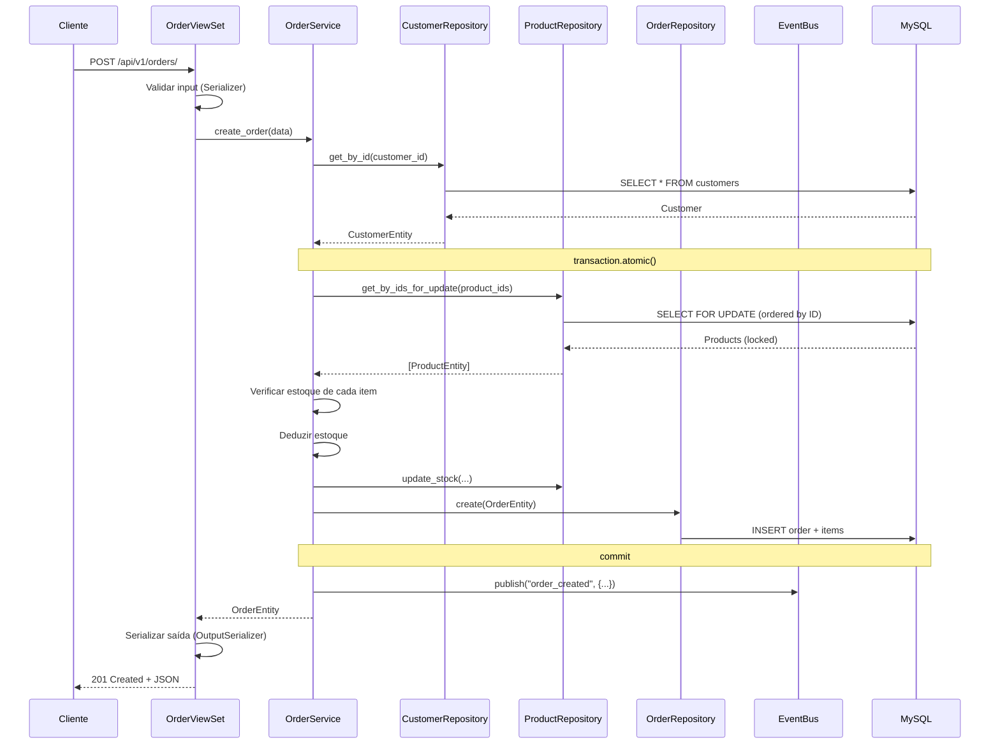

# Documentação da Arquitetura

## 1. Padrões Arquiteturais

Adotaremos uma abordagem de **Arquitetura Limpa** adaptada para Django, enfatizando a separação de responsabilidades e testabilidade.

### Camadas:

1.  **Camada de Apresentação (API)**:
    - **Django Rest Framework (DRF) Views/ViewSets**: Lidam com requisições HTTP, autenticação e verificação de permissões.
    - **Serializers**: Lidam com transformação de DTO e validação básica.
    - **OpenAPI/Swagger**: Documentação gerada automaticamente.

2.  **Camada de Serviço (Regras de Negócio)**:
    - **Services**: Classes Python puras contendo todas as regras de negócio (ex: `OrderService`, `StockService`).
    - **Use Cases**: Operações atômicas como `CreateOrder` (Criar Pedido), `CancelOrder` (Cancelar Pedido).
    - **Eventos de Domínio**: Tratamento de efeitos colaterais como "PedidoCriado" de forma assíncrona.

3.  **Camada de Acesso a Dados (Repositório)**:
    - **Repositories**: Abstrações sobre o Django ORM (ex: `OrderRepository`). Isso desacopla a lógica de negócio da implementação específica do banco de dados, facilitando testes e mudanças futuras.
    - **DataAccess Objects (DAO)**: Django Models.

### Diagrama de Arquitetura (Conceitual)

```mermaid
graph TD
    Client[Cliente / Externo] --> API[Camada de API (Views/Serializers)]
    API --> Service[Camada de Serviço (Regras de Negócio)]
    Service --> Repository[Interface do Repositório]
    Repository --> Model[Django ORM / DB]
    Service --> Redis[Cache/Lock Redis]
```

## 2. Fluxo de Dados

### Ciclo de Vida de uma Requisição

```
HTTP Request → Middleware (Idempotência, Rate Limit)
  → View/ViewSet (validação de entrada via Serializer)
    → Service (regras de negócio, validação de domínio)
      → Repository Interface → Repository Impl → Django ORM → MySQL
    ← Entidade de Domínio
  ← Serializer de saída (DTO)
← HTTP Response (JSON padronizado)
```

### Fluxo de Criação de Pedido (Exemplo Detalhado)



### Fluxo de Erros

```
Exceção de Domínio → custom_exception_handler
  ├── EntityNotFoundException    → 404 {error: {code, message}}
  ├── BusinessRuleViolation      → 422 {error: {code, message}}
  ├── InsufficientStockException → 422 {error: {code, message}}
  ├── InvalidStateTransition     → 422 {error: {code, message}}
  ├── DuplicateRequestException  → 409 {error: {code, message}}
  └── Exceção Inesperada         → 500 {error: {code, message}}
```

## 3. Decisões Técnicas Chave

### 3.1 Concorrência & Gestão de Estoque

- **Problema**: Prevenir condições de corrida (Race Conditions) quando múltiplos usuários tentam comprar o último item (Venda excessiva / Overselling).
- **Solução**: **Bloqueio Pessimista** (`select_for_update`) na tabela `Product` durante a transação de criação do pedido. Isso garante atomicidade.
- **Bloqueio Distribuído com Redis**: Alternativamente, usar Redis para bloquear o ID do recurso durante o processamento para caminhos críticos de alta concorrência fora do BD, mas `select_for_update` é mais seguro para consistência estrita.

### 3.2 Idempotência

- **Mecanismo**: Um middleware ou decorator interceptará requisições `POST /orders`.
- **Implementação**: Verificar o cabeçalho `Idempotency-Key` no Redis.
  - Se a chave existe: Retornar a resposta em cache.
  - Se for nova: Processar e fazer cache do resultado.

### 3.3 Design do Banco de Dados

- **MySQL**: Armazenamento relacional primário.
- **Normalização**: 3ª Forma Normal (3NF) para entidades principais.
- **Índices**: Em `client_id`, `status`, `sku` e `created_at` para filtragem.
- **Soft Delete**: Coluna `deleted_at` para todas as entidades principais.

### 3.4 Escalabilidade & Performance

- **Cache Redis**: Para dados somente leitura acessados frequentemente (ex: catálogo de produtos).
- **Tarefas Assíncronas**: (Opcional, mas bom para "Event Sourcing") Usando Celery ou similar para processar tarefas não bloqueantes como envio de emails ou agregação de logs.

## 4. Stack Tecnológica

- **Linguagem**: Python 3.12+
- **Framework Web**: Django 5.x + DRF
- **Banco de Dados**: MySQL 8.x
- **Cache/Broker**: Redis 7.x
- **Containerização**: Docker & Docker Compose
- **Testes**: Pytest

## 5. Trade-offs (Compromissos)

- **Padrão Repository no Django**: O ORM do Django é efetivamente uma implementação do padrão Repository/Unit of Work. Adicionar uma camada de Repositório explícita adiciona código boilerplate, mas impõe estritamente a separação de responsabilidades, facilitando testes unitários (mockando repositórios em vez do BD).
- **Bloqueio Pessimista**: Reduz o throughput (vazão) comparado ao Bloqueio Otimista, mas garante consistência sem lógica de repetição complexa para o cliente.

## 6. Deployment & DevOps

- **Multi-stage Build**: O Dockerfile separará dependências de build do tempo de execução para minimizar o tamanho da imagem.
- **CI/CD**: GitHub Actions para testes automatizados e linting.
